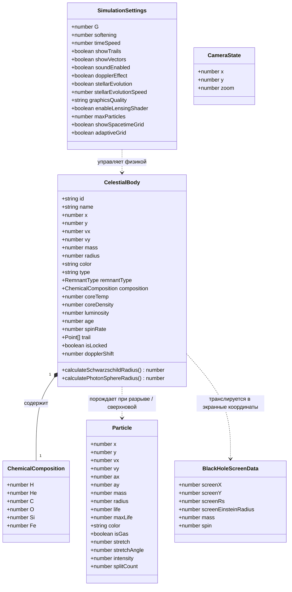
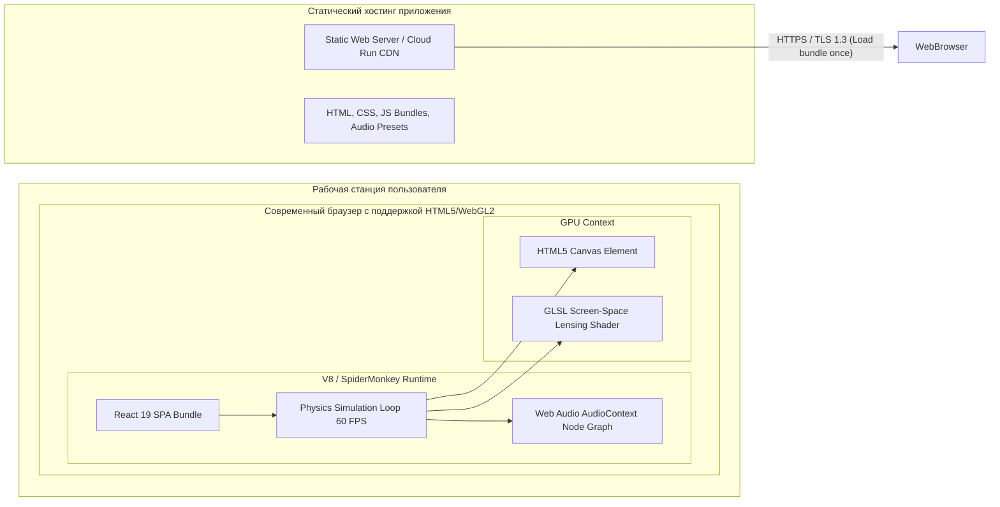
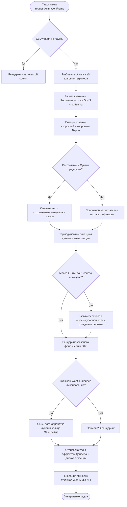
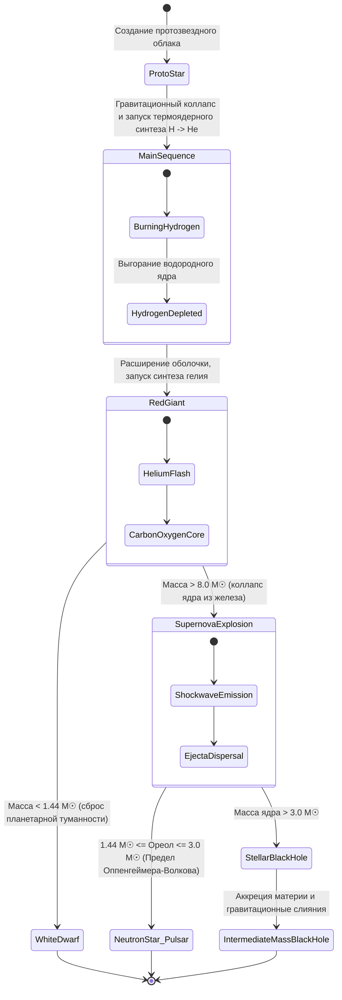
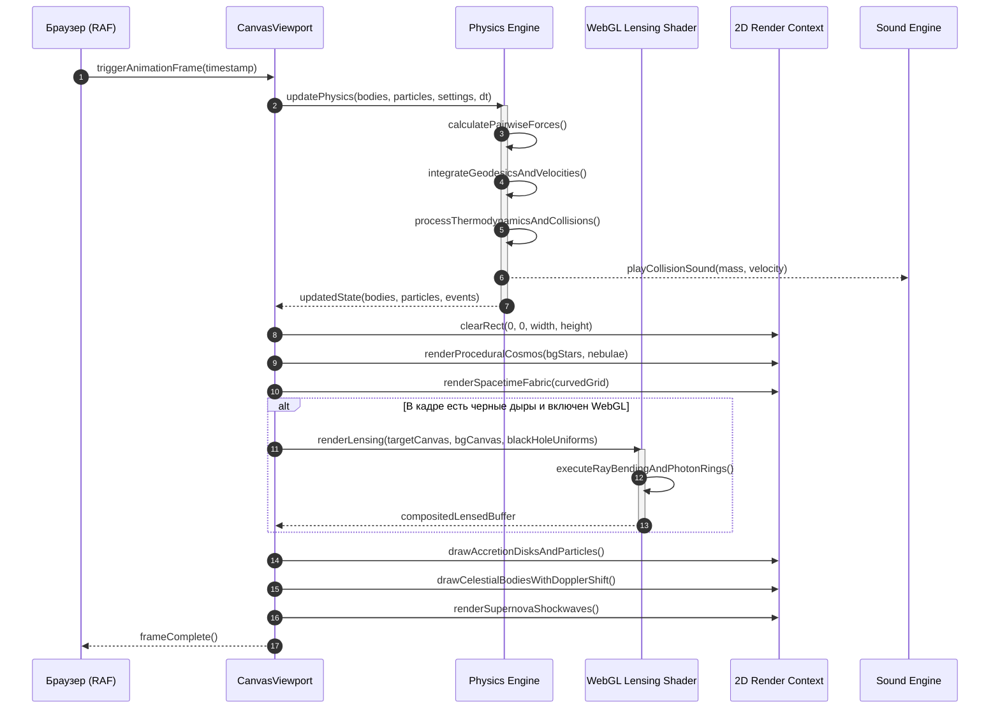
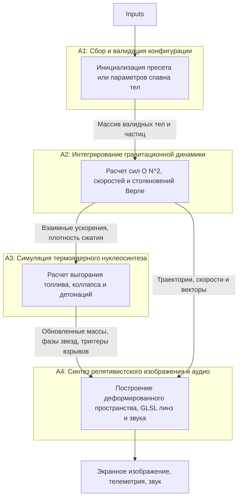
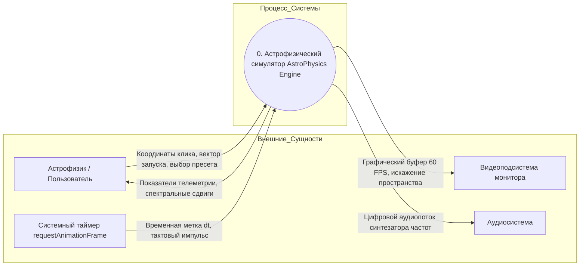

# Обзор архитектурных, поведенческих и функциональных диаграмм проекта
**Проект:** Интерактивный симулятор релятивистской гравитации, гравитационного линзирования и звездной эволюции («AstroPhysics Engine»)  
**Дисциплина:** ПМ.02 «Осуществление интеграции программных модулей»  
**ГБПОУ НСО «НЭК», 2026 г.**

---

## Содержание
1. [Классификация диаграмм](#1-классификация-диаграмм)
2. [Структурные диаграммы (UML)](#2-структурные-диаграммы-uml)
   - 2.1. Диаграмма классов (Class Diagram)
   - 2.2. Диаграмма компонентов (Component Diagram)
   - 2.3. Диаграмма развертывания (Deployment Diagram)
3. [Поведенческие диаграммы (UML)](#3-поведенческие-диаграммы-uml)
   - 3.1. Диаграмма прецедентов (Use Case Diagram)
   - 3.2. Диаграмма деятельности (Activity Diagram)
   - 3.3. Диаграмма состояний (State Machine Diagram)
   - 3.4. Диаграмма последовательности / кооперации (Sequence Diagram)
4. [Функциональные диаграммы (IDEF0 и DFD)](#4-функциональные-диаграммы-idef0-и-dfd)
   - 4.1. IDEF0 A-0 (Контекстная диаграмма)
   - 4.2. IDEF0 A0 (Декомпозиция верхнего уровня)
   - 4.3. DFD Уровень 0 (Контекстная диаграмма потоков данных)
   - 4.4. DFD Уровень 1 (Декомпозиция потоков данных)

---

## 1. Классификация диаграмм

| № | Название диаграммы | Нотация / Стандарт | Тип | Назначение в проекте |
|---|-------------------|--------------------|-----|----------------------|
| 1 | Диаграмма классов | UML 2.5 | Структурная | Описание типов данных небесных тел, состояния физики, камеры и их отношений |
| 2 | Диаграмма компонентов | UML 2.5 | Структурная | Компонентная архитектура модулей UI, Physics Core, WebGL Shader, Web Audio |
| 3 | Диаграмма развертывания | UML 2.5 | Структурная | Физическая топология выполнения в среде Web Browser / V8 / WebGL GPU |
| 4 | Диаграмма Use Case | UML 2.5 | Поведенческая | Пользовательские сценарии исследователя, студента и астрофизика |
| 5 | Диаграмма деятельности | UML 2.5 | Поведенческая | Алгоритм расчета кадра симуляции (гравитация N-тел, слияния, коллапс, рендеринг) |
| 6 | Диаграмма состояний | UML 2.5 | Поведенческая | Жизненный цикл звездного объекта: Протозвезда -> ГП -> Сверхгигант -> Сверхновая -> Реликт |
| 7 | Диаграмма последовательности | UML 2.5 | Поведенческая | Взаимодействие CanvasViewport, PhysicsEngine, WebGLShader и SoundEngine |
| 8 | IDEF0 A-0 | IDEF0 | Функциональная | Контекст процесса «Моделирование астрофизических систем и ОТО» |
| 9 | IDEF0 A0 | IDEF0 | Функциональная | Декомпозиция на ввод параметров, расчет механики, термодинамику и визуализацию |
| 10 | DFD Уровень 0 | Gane-Sarson / Yourdon | Потоки данных | Контекстное движение данных от пользователя и времени к рендереру и аудио |
| 11 | DFD Уровень 1 | Gane-Sarson / Yourdon | Потоки данных | Детализация хранилищ тел, частиц, пресетов и матриц искривления пространства |

---

## 2. Структурные диаграммы (UML)

### 2.1. Диаграмма классов (Class Diagram)
Показывает логическую модель предметной области: сущности небесных тел, частицы аккреции, термодинамический состав и структуры настроек симулятора.



### 2.2. Диаграмма компонентов (Component Diagram)
Описывает архитектуру клиентского приложения, разделение на слои представления (React UI), физического ядра (Physics Engine), графического конвейера (WebGL Lensing Shader & 2D Canvas) и аудиодвижка (Web Audio API).

```mermaid
graph TD
    subgraph Presentation Layer [Уровень представления (UI)]
        App[App.tsx - Главный контейнер]
        HUD[HUDOverlay - Телеметрия и параметры]
        Flyout[FlyoutMenu - Панели настроек и пресетов]
        CanvasView[CanvasViewport - Контроллер полотна рендеринга]
    end

    subgraph Physics Engine Layer [Вычислительный слой физики]
        Engine[engine.ts - Интегратор ОТО и механики N-тел]
        Cosmos[proceduralUniverse.ts - Генератор секторов]
        LensingMath[gravitationalLensing.ts - Геодезические искривления]
    end

    subgraph Graphics & Rendering Layer [Графический конвейер]
        Canvas2D[HTML5 Canvas 2D Context - Тела и шлейфы]
        WebGLShader[screenSpaceLensingShader.ts - GLSL Шейдер гравилинз]
    end

    subgraph Audio Service Layer [Акустический слой]
        SoundSys[sound.ts - Синтезатор Web Audio API]
    end

    App --> CanvasView
    App --> HUD
    App --> Flyout
    CanvasView --> Engine
    CanvasView --> Cosmos
    CanvasView --> LensingMath
    CanvasView --> WebGLShader
    CanvasView --> Canvas2D
    Engine --> SoundSys
```

### 2.3. Диаграмма развертывания (Deployment Diagram)
Показывает бессерверную архитектуру (Single Page Application, SPA), где весь цикл симуляции исполняется на клиентском оборудовании с аппаратным ускорением GPU.



---

## 3. Поведенческие диаграммы (UML)

### 3.1. Диаграмма вариантов использования (Use Case)

```mermaid
graph TD
    User((Пользователь / Студент))
    
    UC1[Запуск и управление течением времени]
    UC2[Выбор астрофизического сценария / пресета]
    UC3[Создание и запуск небесного тела]
    UC4[Настройка физических параметров: G, сетка, линзирование]
    UC5[Наблюдение релятивистских эффектов: Доплер, спагеттификация, горизонт]
    UC6[Инициирование коллапса звезды и взрыва сверхновой]
    UC7[Экспорт/импорт конфигурации симулятора]

    User --> UC1
    User --> UC2
    User --> UC3
    User --> UC4
    User --> UC5
    User --> UC6
    User --> UC7

    UC3 ..> |include| UC4
    UC6 ..> |extend| UC5
```

### 3.2. Диаграмма деятельности (Activity Diagram)
Отражает жизненный цикл единичного такта расчета кадра симуляции (Frame Step Loop).



### 3.3. Диаграмма состояний (State Machine Diagram)
Описывает эволюционные стадии космического объекта.



### 3.4. Диаграмма последовательности (Sequence Diagram)
Взаимодействие компонентов в процессе симуляции одного физического тика и отрисовки кадра с гравитационной линзой.



---

## 4. Функциональные диаграммы (IDEF0 и DFD)

### 4.1. IDEF0 A-0 (Контекстная диаграмма)

```mermaid
graph LR
    subgraph ВХОДЫ_I [Входы - Inputs]
        I1[Начальные координаты и векторы скоростей]
        I2[Параметры тел: масса, состав, радиус]
        I3[Действия пользователя: ввод мышью/тач, масштабирование]
    end

    subgraph УПРАВЛЕНИЕ_C [Управление - Controls]
        C1[Законы классической механики Ньютона]
        C2[Уравнения Эйнштейна ОТО и метрика Шварцшильда]
        C3[Пределы Чандрасекара и Оппенгеймера-Волкова]
        C4[Частота обновления экрана 60 FPS / Budget 16.6ms]
    end

    subgraph ПРОЦЕСС [Главный блок A0]
        MainBlock["А0: Моделирование релятивистских гравитационных систем и звездной эволюции"]
    end

    subgraph ВЫХОДЫ_O [Выходы - Outputs]
        O1[Кадры рендеринга на Canvas с эффектом гравилинзирования]
        O2[Интерактивная телеметрия: скорости, массы, спектры, FPS]
        O3[Акустические события Web Audio API: слияния, взрывы]
    end

    subgraph МЕХАНИЗМЫ_M [Механизмы - Mechanisms]
        M1[Вычислительный процессор CPU / Среда V8]
        M2[Графический ускоритель GPU / Шейдеры WebGL2]
        M3[Библиотека React 19 и HTML5 Canvas API]
    end

    I1 --> MainBlock
    I2 --> MainBlock
    I3 --> MainBlock

    C1 --> MainBlock
    C2 --> MainBlock
    C3 --> MainBlock
    C4 --> MainBlock

    MainBlock --> O1
    MainBlock --> O2
    MainBlock --> O3

    M1 --> MainBlock
    M2 --> MainBlock
    M3 --> MainBlock
```



### 4.2. IDEF0 A0 (Декомпозиция верхнего уровня)



### 4.3. DFD Уровень 0 (Контекстная диаграмма потоков данных)



### 4.4. DFD Уровень 1 (Декомпозиция потоков данных)

```mermaid
graph TD
    subgraph Внешние_Сущности
        User[Пользователь]
        RAF[Таймер браузера]
        Screen[Экран]
        AudioOut[Аудиоканал]
    end

    subgraph Хранилища_Данных
        D1[[(D1) Состояние тел BodiesState]]
        D2[[(D2) Частицы материи ParticlesState]]
        D3[[(D3) Глобальные константы SimulationSettings]]
        D4[[(D4) Каталог пресетов PresetsConfig]]
    end

    subgraph Подпроцессы
        P1((1.1 Управление сценой и ввод))
        P2((1.2 Расчет орбитальной механики))
        P3((1.3 Эволюция звездного состава))
        P4((1.4 Рендеринг метрики и линзирования))
        P5((1.5 Аудио-синтез))
    end

    User --> P1
    D4 --> P1
    P1 --> D1
    P1 --> D3

    RAF --> P2
    D1 <--> P2
    D2 <--> P2
    D3 --> P2

    P2 -- "Данные сжатия и кинетическая энергия" --> P3
    D1 <--> P3
    P3 -- "Эмиссия обломков" --> D2
    P3 -- "События взрывов" --> P5

    D1 --> P4
    D2 --> P4
    D3 --> P4
    P4 --> Screen

    P2 -- "Импульс соударений" --> P5
    P5 --> AudioOut
```

---
*Документ подготовлен для оформления курсового отчета и сдачи практической работы № 9.*
