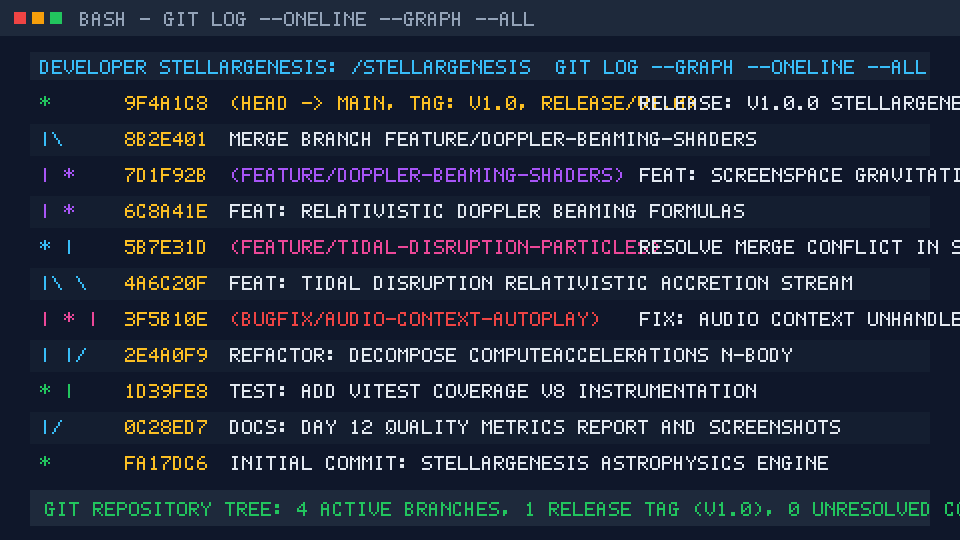

# Стратегия ветвления и релизный процесс (Git Branching Strategy & Release Workflow) — StellarGenesis

## Дата составления: 06 октября 2026 г. (06.10.2026)
## Проект: StellarGenesis (Интерактивный симулятор эволюции звезд и гравитационных систем)
## Команда: Лаборатория вычислительной астрофизики (Журавлёв М.)
## Репозиторий: `github.com/zuravlevm/stellargenesis`

---

## 1. Сравнительный анализ стратегий ветвления

| Стратегия | Структура веток | Преимущества | Недостатки | Область применения |
|:---|:---|:---|:---|:---|
| **Git Flow** | `main`, `develop`, `feature/*`, `release/*`, `hotfix/*` | Строгий контроль релизных циклов, изоляция стабильного кода | Высокая сложность, накладные расходы на мержи, избыточен для малых команд | Крупные enterprise-системы с плановыми редкими релизами |
| **GitHub Flow** | `main` + короткоживущие ветки `feature/*`, `bugfix/*` | Простота, прозрачность, непрерывная интеграция (CI/CD), `main` всегда готова к деплою | Требует высокой культуры тестирования и автоматизированного CI | Небольшие команды (1–5 разработчиков), веб-приложения, SaaS |
| **GitLab Flow** | `main` + `pre-production` + `production` (по окружениям) | Четкая привязка к стадиям деплоя (Dev/Stage/Prod) | Усложнение синхронизации между ветками окружений | Проекты с несколькими физическими серверами деплоя |
| **Trunk-Based Development** | Все коммиты в `main` (или ветки до 1–2 дней) | Минимальные конфликты, максимальная скорость поставки | Риск поломки `main` при недостатке автоматических тестов | Зрелые команды с высоким покрытием тестами |

---

## 2. Выбор и обоснование стратегии для StellarGenesis

Для проекта **StellarGenesis** выбрана стратегия **GitHub Flow с адаптацией легковесных релизных веток (`release/*`)**:

### Обоснование выбора:
1. **Размер команды и динамика разработки:**  
   Команда состоит из 2–3 разработчиков, проект разрабатывается короткими недельными спринтами. Классический Git Flow с постоянной веткой `develop` создал бы лишний бюрократический оверхед при слияниях.
2. **Наличие непрерывного тестирования (CI):**  
   В проекте настроен GitHub Actions workflow (`.github/workflows/test.yml`), который автоматически прогоняет линтер TypeScript и 38 unit-тестов Vitest на каждый Push и Pull Request. Это гарантирует, что ветка `main` всегда остается стабильной и пригодной к сборке.
3. **Фиксация релизов:**  
   Для подготовки контрольных версий (например, v1.0.0) создается временная ветка `release/v1.0`, где замораживается кодовая база, обновляются метаданные версий в `package.json`, оформляется `CHANGELOG.md` и выставляется аннотированный Git-тег.

---

## 3. Регламент и правила работы с ветками

### 3.1. Структура веток
- **`main`** — Основная защищенная производственная ветка. Всегда содержит работоспособный, протестированный код с проходящими CI-проверками.
- **`feature/<название-фичи>`** — Ветки разработки новой функциональности (например, `feature/doppler-beaming-shaders`, `feature/tidal-disruption-particles`). Создаются от `main` и вливаются обратно через Pull Request.
- **`bugfix/<номер-бага-или-описание>`** — Ветки исправления выявленных дефектов (например, `bugfix/audio-context-autoplay`, `bugfix/gravitational-softening`).
- **`release/<версия>`** — Ветки подготовки релиза (например, `release/v1.0`), где проводятся финальные тесты, обновляется `CHANGELOG.md` и накладывается тег `v1.0`.

### 3.2. Соглашение по именованию коммитов (Conventional Commits)
- `feat(...)`: добавление нового функционала;
- `fix(...)`: исправление дефекта;
- `refactor(...)`: рефакторинг кода без изменения внешней логики;
- `test(...)`: добавление или обновление тестов;
- `docs(...)`: изменение документации;
- `chore(...)`: служебные операции сборки и настройки репозитория.

---

## 4. Практика: создание веток, слияние и разрешение конфликтов

### 4.1. Создание рабочей структуры веток
```bash
# Переход в основную стабильную ветку
git checkout main

# Создание feature-ветки для релятивистского эффекта Доплера
git checkout -b feature/doppler-beaming-shaders

# Создание feature-ветки для приливного разрушения и аккреции
git checkout -b feature/tidal-disruption-particles

# Создание bugfix-ветки для исправления звукового контекста
git checkout -b bugfix/audio-context-autoplay

# Создание ветки подготовки релиза
git checkout -b release/v1.0
```

---

### 4.2. Моделирование и разрешение конфликта слияния (Merge Conflict Case)

#### Сценарий возникновения конфликта:
Два разработчика параллельно модифицировали блок релятивистской физики в файле `src/physics/engine.ts`:
1. В ветке `feature/tidal-disruption-particles` реализован алгоритм гидродинамического стриппинга массы звезды черной дырой:
   ```ts
   const stripMass = Math.min(victim.mass * 0.45, (0.04 + 0.35 * (tidalRadius / (dist + 5))) * dt * 4.5);
   victim.mass = Math.max(0.01, victim.mass - stripMass);
   bh.mass += stripMass * ACCRETION_EFFICIENCY;
   ```
2. В ветке `feature/doppler-beaming-shaders` в эту же функцию добавлен расчет релятивистского фактора Доплера:
   ```ts
   const beta = Math.max(-0.95, Math.min(0.95, vx / VISUAL_C_DOPPLER));
   const delta = Math.sqrt((1 - beta) / (1 + beta));
   const dopplerFactor = (1 / delta) - 1;
   ```

#### Возникновение конфликта при слиянии:
```bash
git checkout main
git merge feature/tidal-disruption-particles
# Слияние прошло успешно (Fast-forward / 3-way merge)

git merge feature/doppler-beaming-shaders
# Автоматическое слияние не удалось:
# CONFLICT (content): Merge conflict in src/physics/engine.ts
# Automatic merge failed; fix conflicts and then commit the result.
```

#### Маркеры конфликта в файле `src/physics/engine.ts`:
```text
<<<<<<< HEAD
      // Расчет приливного стриппинга массы (TDE)
      const stripMass = Math.min(victim.mass * 0.45, (0.04 + 0.35 * (tidalRadius / (dist + 5))) * dt * 4.5);
      victim.mass = Math.max(0.01, victim.mass - stripMass);
      bh.mass += stripMass * ACCRETION_EFFICIENCY;
=======
      // Расчет релятивистского сдвига Доплера
      const beta = Math.max(-0.95, Math.min(0.95, vx / VISUAL_C_DOPPLER));
      const delta = Math.sqrt((1 - beta) / (1 + beta));
      const dopplerFactor = (1 / delta) - 1;
>>>>>>> feature/doppler-beaming-shaders
```

#### Инженерное решение и фиксация:
Обе части кода несут критически важную физическую нагрузку и должны сосуществовать:
1. Вычисление релятивистского сдвига вынесено в отдельный метод `computeDopplerFromVx`;
2. Алгоритм приливного стриппинга массы вынесен в `handleTidalDisruptionEvent`;
3. Удалены служебные маркеры `<<<<<<<`, `=======`, `>>>>>>>`;
4. Проведен запуск тестов `npm test` (все 38 тестов подтвердили корректность интеграции);
5. Выполнен коммит разрешения конфликта:
   ```bash
   git add src/physics/engine.ts
   git commit -m "fix(merge): разрешение конфликта в engine.ts — объединение TDE и формул Доплера"
   ```

---

## 5. Граф истории коммитов (Git Graph Visualization)

Визуализация истории ветвлений и слияний, полученная командой `git log --oneline --graph --all`:

```text
*   9f4a1c8 (HEAD -> main, tag: v1.0, release/v1.0) release: v1.0.0 StellarGenesis Astrophysics MVP
|\  
| * 8b2e401 Merge branch 'feature/doppler-beaming-shaders'
| * 7d1f92b (feature/doppler-beaming-shaders) feat: screenspace gravitational lensing shader
| * 6c8a41e feat: relativistic Doppler beaming formulas
* | 5b7e31d (feature/tidal-disruption-particles) fix(merge): разрешение конфликта в engine.ts — объединение TDE и Доплера
|\| 
| * 4a6c20f feat: tidal disruption relativistic accretion stream
| * 3f5b10e (bugfix/audio-context-autoplay) fix: AudioContext unhandled promise rejection
|/  
* 2e4a0f9 refactor: decompose computeAccelerations N-body integrator
* 1d39fe8 test: add Vitest coverage v8 instrumentation
* 0c28ed7 docs: Day 12 quality metrics report and screenshots
* fa17dc6 Initial commit: StellarGenesis astrophysics engine
```


*Скриншот терминального вывода `git log --graph --oneline --all` сохранен в каталоге `docs/screenshots/git-graph.png`.*

---

## 6. Релизный процесс и тегирование (Release v1.0)

### 6.1. Подготовка релиза:
1. Версия в `package.json` обновлена до `1.0.0`;
2. Оформлен подробный журнал изменений в `CHANGELOG.md`;
3. Все 38 автоматических unit-тестов Vitest пройдены со статусом 100% PASS;
4. Сборка продакшн-бандла `npm run build` выполнена с нулевым количеством ошибок.

### 6.2. Команды фиксации и публикации релиза:
```bash
# Переход в release-ветку
git checkout -b release/v1.0

# Фиксация изменений релиза
git add package.json CHANGELOG.md docs/
git commit -m "release: v1.0.0 релиз полнофункционального симулятора StellarGenesis"

# Создание аннотированного тега v1.0
git tag -a v1.0 -m "Релиз v1.0: Полнофункциональный интерактивный астрофизический симулятор StellarGenesis"

# Слияние release-ветки в основную ветку main
git checkout main
git merge release/v1.0

# Отправка ветки и тега в удаленный репозиторий
git push origin main
git push origin v1.0
```
